# Ableton Dev Salon
An Introduction to ClojureScript
### Brent Shields and Jack Schaedler
### 17.04.2014

---

# Clojure
### A Lisp dialect for the JVM
- Dynamic
- Hosted / Leverages Java ecosystem
- Built-in collection of __immutable__, __persistent__ data structures
- Concurrency done right / STM Agents CSP TLS
- Metaprogramming / Macros
- Functional but pragmatic

---

# ClojureScript
### Clojure compiled to JavaScript
- Run on js clients / Browser Desktop Mobile Server
- Interop with js libraries
- Leverage the Googleplex via Closure compiler
- Dynamic host language enables additional features

---

# ClojureScript Toolchain

- cljs cannot compile itself
- Clojure compiler consumes cljs and emits js
- Leiningen is your friend.  Use the lein-cljsbuild plugin.
- The emitted js is either used directly or fed to Closure, Google's optimizing js compiler, depending on the optimization settings.
- Closure's advanced optimization mode can yield dramatic improvements.

---
#Who
##Rich Hickey

- Clojure creator and provocative speaker
- Highly recommended talks
  - Are we there yet?
  - Simple made easy
  - Hammock driven development
  - The value of values

---

#Who
## David Nolen

- Developer at the New York Times
- Primary maintainer of ClojureScript
- Primary author of core.logic and core.match
- Om web framework
- Recent talk of note: The Functional Final Frontier

---

#The Absolute Basics

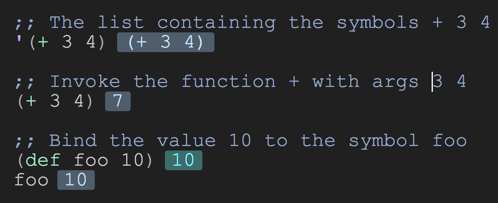

---

#Data Structures

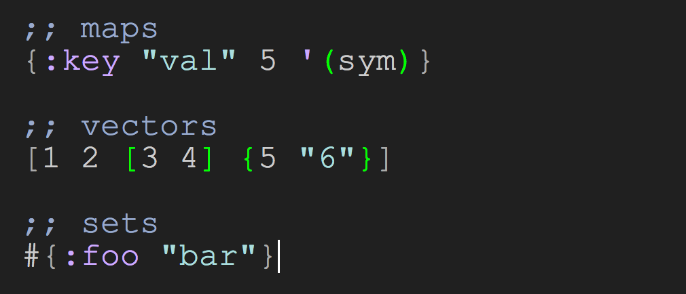

---

#First Class Functions

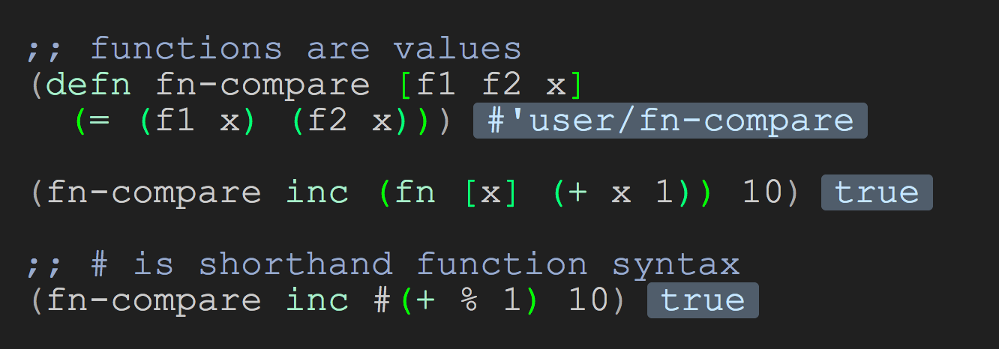

---

#Metaprogramming
##Macros

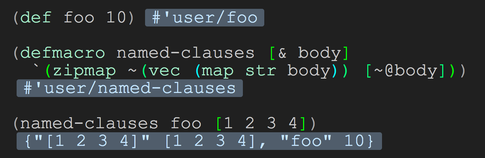

---

#Macros provide extensible semantics

Enables 'language features' as libraries

- _Logic programming_: `core.logic`

- _Optional type system with inference_: `core.typed`

- _Pattern matching_: `core.match`

- _CSP_: `core.async`

---
#Runtime Polymorphism
##Protocols

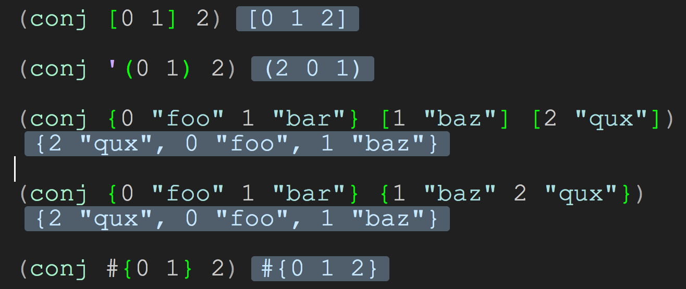

---
#Runtime Polymorphism
##Multimethods

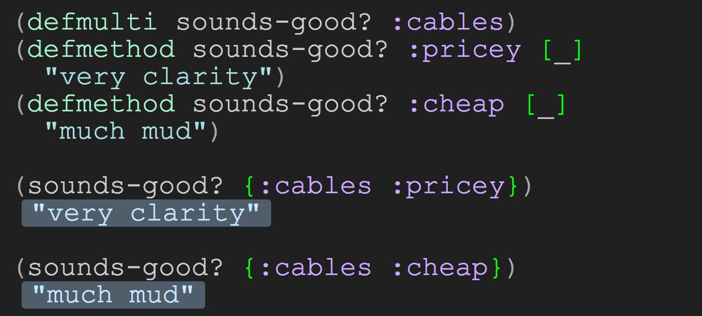

---

#Data Structures
##Immutable and Persistent

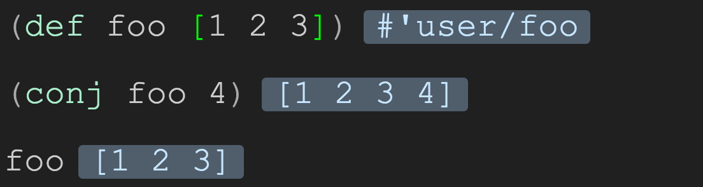

---
#Data Structures
##Immutable and Persistent

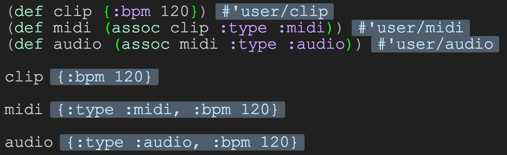

---

#Isn't that inefficient?

- Naive implementation would just copy
- __Immutability enables structural sharing__
- Sophisticated data structure implementatation necessary for practical usage.
- Not sufficient to just avoid mutation in a procedural / OO language.
- More on this later...

---
#How do we remember things?

- Pure functional approach very good for modeling computations
- Doesn't fit as well for stateful user interaction
- We want Clojure on the __client__
- How to maintain state between user events?

---

#The missing piece
## Atom

- The __only__ mutable data type in cljs (outside of js interop)
- A box that stores a value
- The value that is stored can be exchanged for a different value

---

#Atom

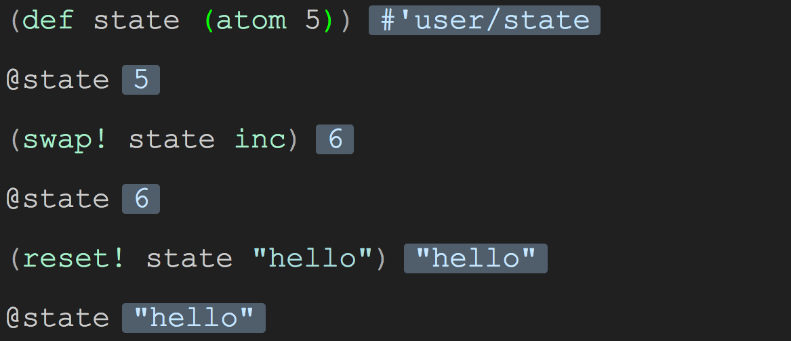

---

#Epochal Time Model

- Time is discrete
- Clients observe snapshots of state over time
- Snapshots are values. Values are immutable.
- The next time quantum is calculated as a function of the previous.
- Every observable mutation of state represents an increment in time

---

#Epochal Time Model
- I want my programs to be like this!
- Put all application state in a single atom.  Done!
- Great, but...
  - Usually more than one atom is desirable.
  - If more than one, time increments are the union of all atom mutations
  - Time advances when any event handler or state observer mutates an atom

---

#funken

- Reactive programming with an epochal time model
- signals update over time, but only observed in discrete frames
- progression of time is __explicit__
- within a given time frame, the observed value of a signal does not change
- signals can be mutable, but modifications are not observed until the next frame

---

#funken

- Observers can subscribe to notifications when signals change
- Only notified when a new frame is committed __and__ the signal value has changed since the last frame

---

#Demo
##Conway's Game Of Life

---

#Persistent Data Structures Redux
##Memory Footprint
##5000 cells over 5000 generations

- Simulation
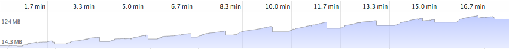
- Randomized
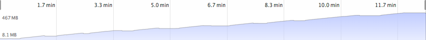
